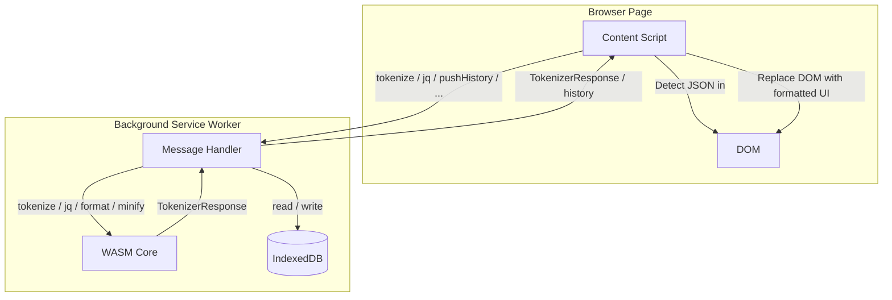
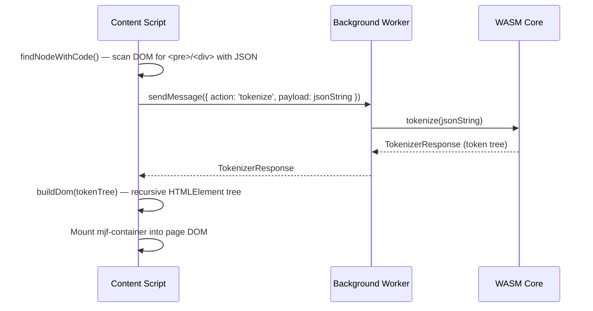
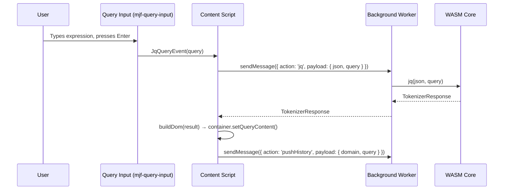
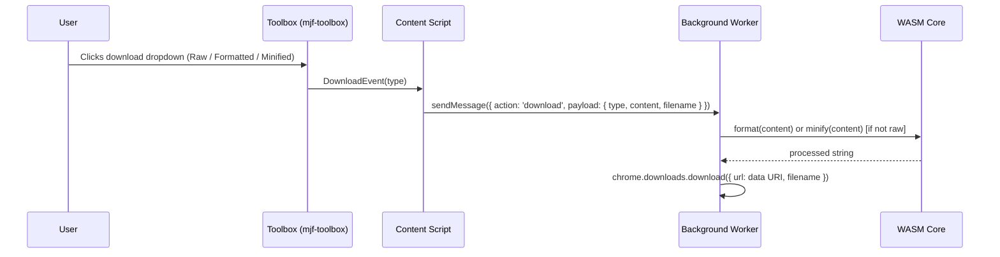

# Contributing to Modern JSON Formatter

Thank you for your interest in contributing! This guide covers everything you need to get started.

## Table of Contents

- [Prerequisites](#prerequisites)
- [Getting Started](#getting-started)
- [Project Structure](#project-structure)
- [Architecture Overview](#architecture-overview)
  - [Formatting Flow](#formatting-flow)
  - [Query Flow](#query-flow)
  - [Query History (IndexedDB)](#query-history-indexeddb)
  - [Download Flow](#download-flow)
  - [Message Passing](#message-passing)
- [Development Workflow](#development-workflow)
- [Verifying Your Build](#verifying-your-build)
- [Writing Tests](#writing-tests)
- [Best Practices](#best-practices)

---

## Prerequisites

Before you begin, install the following tools:

| Tool               | Purpose            | Install                                                                       |
|--------------------|--------------------|-------------------------------------------------------------------------------|
| **Node.js** (v24+) | JavaScript runtime | [nodejs.org](https://nodejs.org)                                              |
| **Yarn** (v4.13+)  | Package manager    | `corepack enable`                                                             |
| **Rust** (v1.60+)  | WASM core build    | [rust-lang.org](https://rust-lang.org/tools/install/)                         |
| `wasm-pack`        | WASM bindgen tool  | [wasm-bindgen.github.io](https://wasm-bindgen.github.io/wasm-pack/installer/) |
| **GNU Make**       | Build runner       | [gnu.org/software/make](https://www.gnu.org/software/make/)                   |

Verify your setup:

```bash
node --version
yarn --version
rustc --version
wasm-pack --version
```

---

## Getting Started

1. Fork and clone the repository

```bash
git clone https://github.com/<your-username>/modern-json-formatter.git
cd modern-json-formatter
```

2. Install Node.js dependencies

```bash
yarn install
```

3. Build the WASM core (required before any TypeScript build or test run)

```bash
make build-worker-wasm
```

4. Start watching for changes and rebuild on save

```bash
yarn dev
```

> **Note:** The WASM core (`worker-wasm/`) must be built at least once before running `yarn test` or any build command.
> If you modify Rust code, re-run `make build-worker-wasm`.

---

## Project Structure

```
modern-json-formatter/
├── src/
│   ├── content-script/   # Injected into pages — detects and renders JSON
│   │   ├── json-detector/   # Finds the <pre>/<div> node containing JSON
│   │   ├── dom/             # Builds interactive HTML tree from token nodes
│   │   └── ui/              # Lit web components (toolbar, query input, container)
│   ├── background/        # Service worker — tokenization, JQ queries, downloads, history
│   ├── options/           # Extension settings page
│   ├── faq/               # In-extension help page
│   └── core/              # Shared utilities, browser API wrappers, UI primitives
│       ├── background/      # Typed message bindings (content script → background)
│       └── browser/         # Chrome extension API wrappers with retry logic
├── worker-wasm/           # Rust/WASM core (JSON parsing, JQ queries, formatting)
│   └── core/              # Pure Rust logic (no WASM bindings) — testable via cargo test
├── testing/               # Shared test mocks and fixtures
├── assets/                # Static assets copied to dist/
├── rsbuild.config.ts      # Build configuration
└── Makefile               # Release and build orchestration
```

**Path aliases** (TypeScript):

- `@core/*` → `src/core/*`
- `@testing/*` → `testing/*`
- `@wasm` → `worker-wasm/pkg` (compiled WASM bindings)
- `@wasm/types` → `worker-wasm/types`

---

## Architecture Overview

The extension has two JavaScript contexts that communicate via Chrome's message passing API:

- **Content script** — runs inside the page, owns the DOM
- **Background service worker** — owns the WASM module, IndexedDB, and `chrome.downloads`



---

### Formatting Flow

This is the primary flow: the content script detects a JSON page, sends the raw text to the background for tokenization,
then builds an interactive DOM tree from the returned token nodes.



**Key files:**

| File                                                      | Role                                                                            |
|-----------------------------------------------------------|---------------------------------------------------------------------------------|
| `src/content-script/extension.ts`                         | Entry point — orchestrates detection and rendering                              |
| `src/content-script/json-detector/find-node-with-code.ts` | Finds the `<pre>` or `<div hidden>` node containing JSON                        |
| `src/core/background/binding.ts`                          | `tokenize(json)` — sends the message and unwraps the response                   |
| `src/background/handler.ts`                               | Routes messages to the correct WASM function                                    |
| `src/content-script/dom/build-dom.ts`                     | `buildDom(token)` — recursively builds the interactive HTML tree                |
| `src/content-script/dom/build-object-node.ts`             | Renders `{ }` objects with collapsible properties                               |
| `src/content-script/dom/build-array-node.ts`              | Renders `[ ]` arrays with collapsible items                                     |
| `src/content-script/dom/build-primitive-nodes.ts`         | Renders strings (with URL/email detection), numbers, booleans, null             |
| `src/content-script/ui/container/container.ts`            | `mjf-container` — closed shadow root, switches between formatted/raw/query tabs |

**Detection logic** (`json-detector/`):

1. Searches for a `<pre>` element; falls back to `<div hidden>` (Edge browser behaviour).
2. Tests the content against `/^\s*[{[\d"]|^\s*true|^\s*false/`.
3. If the JSON exceeds ~3 MB, calls `format()` (WASM) and renders a plain `<pre>` instead of the interactive tree to
   avoid memory pressure.

**Token node types** (from `@wasm/types`):

```typescript
type TokenNode =
  | { type: 'string'; value: string }
  | { type: 'number'; value: string }
  | { type: 'boolean'; value: boolean }
  | { type: 'null' }
  | { type: 'array'; items: TokenNode[] }
  | { type: 'object'; properties: { key: string; value: TokenNode }[] }

type TokenizerResponse = TokenNode | TupleNode | ErrorNode
```

---

### Query Flow

Users can run [JQ](https://jqlang.github.io/jq/) expressions against the current JSON. The query input is a Lit web
component that sends expressions to the background, which evaluates them via the WASM `jq` function.



**Key files:**

| File                                                           | Role                                                                                       |
|----------------------------------------------------------------|--------------------------------------------------------------------------------------------|
| `src/content-script/ui/query-input/query-input.ts`             | `mjf-query-input` — text input, dispatches `JqQueryEvent` on Enter                         |
| `src/content-script/ui/query-input/autocomplete.controller.ts` | Debounced autocomplete — calls `getHistory(hostname, prefix)` and populates a `<datalist>` |
| `src/content-script/extension.ts`                              | Listens for `jq-query` event, calls `jq()`, calls `pushHistory()`                          |
| `src/core/background/binding.ts`                               | `jq(json, query)` and `pushHistory(domain, query)` message bindings                        |
| `src/background/handler.ts`                                    | Routes `'jq'` messages to the WASM `query()` function                                      |
| `src/background/history.ts`                                    | IndexedDB read/write for query history                                                     |

---

### Query History (IndexedDB)

The background service worker persists per-domain query history in IndexedDB so that the query input can offer
autocomplete suggestions.

**Database:** `ModernJSONFormatterDB` (version 3)
**Object store:** `query-history`

| Field    | Type   | Key                      | Index                                         |
|----------|--------|--------------------------|-----------------------------------------------|
| `id`     | number | Primary (auto-increment) | —                                             |
| `domain` | string | —                        | `domain` (simple), `domain_query` (composite) |
| `query`  | string | —                        | `domain_query` (composite)                    |

The composite index `domain_query` enforces uniqueness of `(domain, query)` pairs. When `pushHistory` is called with an
already-stored query it deletes the old record and re-inserts it — this naturally moves the entry to the top of the
most-recent ordering (sorted by descending `id`).

**`getHistory(domain, prefix)`** — called on every keystroke (250 ms debounce):

1. Reads all records for the current `domain` via the `domain` index.
2. Sorts by `id` descending (most recent first).
3. Filters entries whose `query` starts with `prefix`.
4. Returns up to 10 matches as an array of strings.

**`pushHistory(domain, query)`** — called after a successful JQ evaluation:

1. Looks up the `(domain, query)` pair in the `domain_query` index.
2. Deletes the existing record if found.
3. Inserts a new record — the new auto-increment `id` places it at the top.

> **Suggestion:** The history size per domain is currently unbounded. A future improvement could cap it (e.g., keep the
> 100 most-recent unique queries per domain) to prevent unbounded IndexedDB growth for long-running browser sessions.

---

### Download Flow

Users can download the current JSON as raw, pretty-formatted, or minified. The content script sends the raw JSON string
to the background, which applies WASM formatting/minification before triggering `chrome.downloads`.



**Key files:**

| File                                       | Role                                                                    |
|--------------------------------------------|-------------------------------------------------------------------------|
| `src/content-script/ui/toolbox/toolbox.ts` | Dropdown dispatches `DownloadEvent('raw' \| 'formatted' \| 'minified')` |
| `src/content-script/extension.ts`          | Listens for `download` event, constructs filename, calls `download()`   |
| `src/core/background/binding.ts`           | `download(type, content, filename)` message binding                     |
| `src/background/download.ts`               | Applies WASM processing, calls `chrome.downloads.download()`            |

---

### Message Passing

All content-script ↔ background communication goes through a typed bridge in `src/core/background/binding.ts`. Every
message has an `action` discriminator:

```typescript
type Message =
  | { action: 'tokenize'; payload: string }
  | { action: 'jq'; payload: { json: string; query: string } }
  | { action: 'format'; payload: string }
  | { action: 'pushHistory'; payload: { domain: string; query: string } }
  | { action: 'getHistory'; payload: { domain: string; prefix: string } }
  | { action: 'clearHistory'; payload: { domain: string } }
  | { action: 'getDomains'; payload: void }
  | { action: 'download'; payload: { type: DownloadType; content: string; filename: string } }
```

Errors are returned as `ErrorNode` objects and rethrown by the bridge:

```typescript
type ErrorNode = {
  type: 'error';
  scope: 'tokenizer' | 'jq' | 'worker';
  error: string;
  stack?: string;
}
```

`sendMessage` in `src/core/browser/index.ts` implements three automatic retries to handle cases where the service worker
has been suspended by the browser.

---

## Development Workflow

### TypeScript / UI changes

```bash
yarn dev        # Dev server with hot reload
yarn lint       # Check code style
yarn lint --fix # Auto-fix code style issues
yarn test       # Run all tests
```

### Rust / WASM changes

```bash
# Run Rust unit tests (no WASM required)
cargo test --manifest-path worker-wasm/core/Cargo.toml

# Rebuild the WASM binary after Rust changes
make build-worker-wasm
```

### Loading the extension in Chrome

1. Run `yarn build` (or `yarn dev` for hot reload)
2. Open `chrome://extensions/`
3. Enable **Developer mode**
4. Click **Load unpacked** and select the `dist/` folder

---

## Verifying Your Build

**Every change must pass this full verification sequence before submitting:**

```bash
yarn lint --fix && yarn test && yarn build:production
```

What each step checks:

| Command                 | What it validates                                                                                  |
|-------------------------|----------------------------------------------------------------------------------------------------|
| `yarn lint --fix`       | Code style (auto-fixes quotes, import order, etc.). Any remaining errors require manual fixes.     |
| `yarn test`             | Full test suite — all tests must pass.                                                             |
| `yarn build:production` | Production build with TypeScript type-checking. Catches type errors that the test runner does not. |

If any step fails, fix the issue and re-run **the full sequence from the beginning**.

To run a single test file during development:

```bash
yarn test src/path/to/file.test.ts
```

> **Release integrity verification** — if you need to verify that a published release matches a local build,
> see [SECURITY.md — Verifying Release Integrity](SECURITY.md#verifying-release-integrity).

---

## Writing Tests

Tests live next to source files: `foo.ts` → `foo.test.ts`.

The test runner is **Rstest** (Vitest-compatible) with **happy-dom** for DOM APIs.

### Available mocks (`testing/`)

```typescript
import '@testing/browser.mock';       // Chrome extension APIs
import '@testing/background.mock';    // Background script message handlers
import '@testing/worker-wasm.mock';   // WASM exports (tokenize, jq, format, minify)
```

### Token fixtures

```typescript
import { tObject, tArray, tString, tNull } from '@testing/json';
```

### Mock typing helper

```typescript
import { wrapMock } from '@testing/helpers';
```

### Example test structure

```typescript
import { describe, it, expect, vi } from 'vitest';
import '@testing/browser.mock';

describe('MyComponent', () => {
  it('should do something', () => {
    // arrange
    // act
    // assert
    expect(result).toBe(expected);
  });
});
```

---

## Best Practices

### General

- Keep changes focused — one logical change per PR.
- Add or update tests for any behavior you change.
- Do not commit `dist/` or generated WASM artifacts (`worker-wasm/pkg/`).

### Rust / WASM

- Pure logic belongs in `worker-wasm/core/` (no WASM bindings). This makes it testable with `cargo test`.
- WASM bindings live in `worker-wasm/` via `wasm-bindgen`.
- Run `cargo test` before rebuilding WASM to catch logic errors early.

### TypeScript / Lit components

- New UI components go in `src/core/ui/` if reusable, or next to the feature that uses them otherwise.
- The `mjf-container` shadow root is **closed** — do not attempt to pierce it in tests.
- WASM is mocked in tests via `@testing/worker-wasm.mock`. Never import `@wasm` directly in test files.

### Styles

- Shared SASS variables are in `src/core/styles/`. Use them instead of hardcoding values.
- Follow the existing pattern for adaptive theming (see options/FAQ pages for reference).

### What NOT to do

- Do not add features, refactoring, or "improvements" beyond what is needed for your change.
- Do not add docstrings or comments to code you did not change.
- Do not skip `yarn lint` — the CI will fail.
- Do not force-push to `main`.
