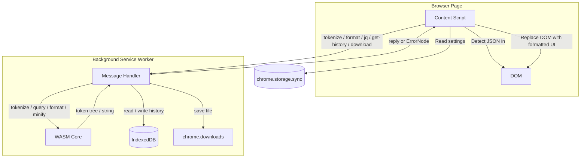
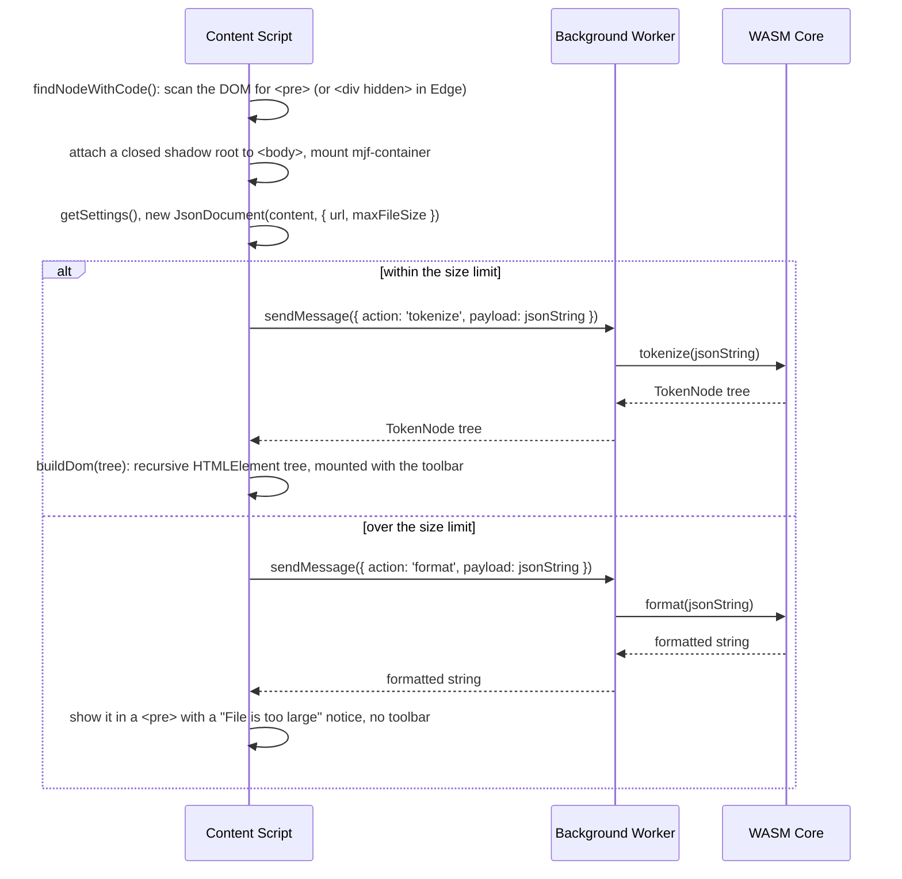
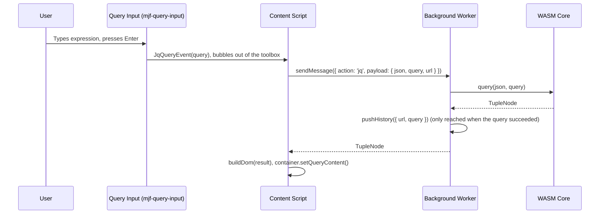
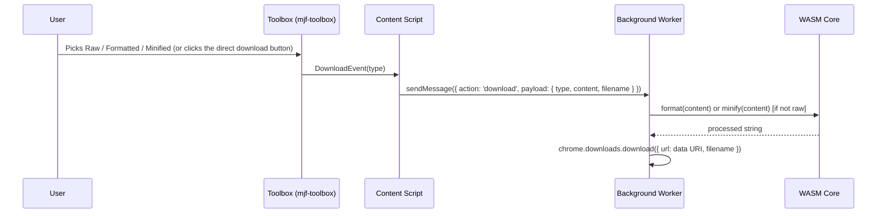

# Contributing to Modern JSON Formatter

This guide explains how to build the extension, how its parts talk to each other, and how to test a change.

## Table of Contents

- [Prerequisites](#prerequisites)
- [Getting Started](#getting-started)
- [Project Structure](#project-structure)
- [Architecture Overview](#architecture-overview)
  - [Formatting Flow](#formatting-flow)
  - [Query Flow](#query-flow)
  - [Query History (IndexedDB)](#query-history-indexeddb)
  - [Download Flow](#download-flow)
  - [Settings](#settings)
  - [Message Passing](#message-passing)
- [Development Workflow](#development-workflow)
- [Verifying Your Build](#verifying-your-build)
- [Writing Tests](#writing-tests)
- [End-to-End Tests](#end-to-end-tests)
- [Best Practices](#best-practices)

## Prerequisites

| Tool              | Purpose                                         | Install                                                                       |
|-------------------|-------------------------------------------------|-------------------------------------------------------------------------------|
| Node.js (v24+)    | JavaScript runtime                              | [nodejs.org](https://nodejs.org)                                              |
| Yarn (v4.13+)     | Package manager                                 | `corepack enable`                                                             |
| Rust (v1.85+)     | WASM core build (the core crate uses edition 2024) | [rust-lang.org](https://rust-lang.org/tools/install/)                      |
| `wasm-pack`       | WASM bindgen tool                               | [wasm-bindgen.github.io](https://wasm-bindgen.github.io/wasm-pack/installer/) |
| GNU Make          | Build runner                                    | [gnu.org/software/make](https://www.gnu.org/software/make/)                   |
| `jq`, `zip`       | Used by `make pack-extension` and `make release` | your package manager                                                         |
| Docker (optional) | Runs `make e2e` and `make e2e-update`           | [docker.com](https://www.docker.com/)                                         |

Check your setup:

```bash
node --version
yarn --version
rustc --version
wasm-pack --version
```

## Getting Started

1. Fork and clone the repository

```bash
git clone https://github.com/<your-username>/modern-json-formatter.git
cd modern-json-formatter
```

2. Install Node.js dependencies

```bash
yarn install
```

3. Build the WASM core (required before any TypeScript build or test run)

```bash
make build-worker-wasm
```

4. Rebuild the extension into `dist/` on every change

```bash
yarn dev
```

> **Note:** Build the WASM core (`worker-wasm/`) at least once before running `yarn test` or any build command.
> Re-run `make build-worker-wasm` after every change to the Rust code.

## Project Structure

```
modern-json-formatter/
├── src/
│   ├── content-script/   # Injected into every page: detects and renders JSON
│   │   ├── json-detector/   # Finds the <pre> (or Edge's <div hidden>) node holding the JSON
│   │   ├── document/        # JsonDocument: size check, render, query and download for one page
│   │   ├── dom/             # Builds the interactive HTML tree from token nodes
│   │   └── ui/              # Lit web components (toolbar, query input, container, error node, info button)
│   ├── background/        # Service worker: tokenize, format, jq queries, downloads, query history
│   ├── options/           # Extension settings page
│   ├── faq/               # In-extension jq manual (Markdown sections with runnable examples)
│   └── core/              # Code shared by every entry point
│       ├── background/      # Message protocol (protocol.ts) and typed client (binding.ts)
│       ├── browser/         # Chrome extension API wrappers; sendMessage retries a lost connection
│       ├── settings/        # Settings stored in chrome.storage.sync
│       └── ui/              # Reusable Lit components (buttons, dropdown, table, sticky panel, ...)
├── worker-wasm/           # Rust/WASM bindings (wasm-bindgen) and shared TypeScript types
│   └── core/              # Pure Rust logic (parse, tokenize, query, format, minify, hashes), testable via cargo test
├── e2e/                   # Playwright end-to-end tests against the built extension
├── plugins/               # Rsbuild plugin that generates manifest.json
├── testing/               # Shared test mocks and fixtures
├── assets/                # Static assets copied to dist/ (fonts, icons)
├── rsbuild.config.ts      # Build configuration and the base manifest
└── Makefile               # Release and build orchestration
```

TypeScript path aliases:

- `@core/*` → `src/core/*`
- `@testing/*` → `testing/*`
- `@wasm` → `worker-wasm/pkg` (compiled WASM bindings)
- `@wasm/types` → `worker-wasm/types`

## Architecture Overview

The extension has two JavaScript contexts that communicate through Chrome's message passing API:

- The content script runs inside the page and owns the DOM.
- The background service worker owns the WASM module, IndexedDB and `chrome.downloads`.

Settings live in `chrome.storage.sync`, which both the content script and the options page read directly.


```mermaid
flowchart TD
  subgraph Page["Browser Page"]
    Dom[DOM]
    CS[Content Script]
  end

  subgraph BG["Background Service Worker"]
    Handler[Message Handler]
    Wasm[WASM Core]
    IDB[(IndexedDB)]
    Downloads[chrome.downloads]
  end

  Storage[(chrome.storage.sync)]

  CS -->|Detect JSON in| Dom
  CS -->|Replace DOM with formatted UI| Dom
  CS -->|Read settings| Storage
  CS -->|" tokenize / format / jq / get-history / download "| Handler
  Handler -->|tokenize / query / format / minify| Wasm
  Wasm -->|token tree / string| Handler
  Handler -->|read / write history| IDB
  Handler -->|save file| Downloads
  Handler -->|reply or ErrorNode| CS
```

### Formatting Flow

The content script finds the JSON on the page, reads the settings, and asks the background to tokenize the raw text. It
then builds an interactive DOM tree from the returned token nodes. A document larger than the size limit from the
settings is sent to `format` instead and shown as plain text.


```mermaid
sequenceDiagram
  participant CS as Content Script
  participant BG as Background Worker
  participant Wasm as WASM Core
  CS ->> CS: findNodeWithCode(): scan the DOM for <pre> (or <div hidden> in Edge)
  CS ->> CS: attach a closed shadow root to <body>, mount mjf-container
  CS ->> CS: getSettings(), new JsonDocument(content, { url, maxFileSize })
  alt within the size limit
    CS ->> BG: sendMessage({ action: 'tokenize', payload: jsonString })
    BG ->> Wasm: tokenize(jsonString)
    Wasm -->> BG: TokenNode tree
    BG -->> CS: TokenNode tree
    CS ->> CS: buildDom(tree): recursive HTMLElement tree, mounted with the toolbar
  else over the size limit
    CS ->> BG: sendMessage({ action: 'format', payload: jsonString })
    BG ->> Wasm: format(jsonString)
    Wasm -->> BG: formatted string
    BG -->> CS: formatted string
    CS ->> CS: show it in a <pre> with a "File is too large" notice, no toolbar
  end
```

Key files:

| File                                                      | Role                                                                                   |
|-----------------------------------------------------------|----------------------------------------------------------------------------------------|
| `src/content-script/main.ts`                              | Content script entry point; calls `runExtension()`                                     |
| `src/content-script/extension.ts`                         | Orchestrates detection, rendering, the toolbar and its events                          |
| `src/content-script/json-detector/get-node-with-code.ts`  | Picks the `<pre>` (or Edge's `<div hidden>`) node and checks that it looks like JSON   |
| `src/content-script/document/json-document.ts`            | Size check, `render()`, `query()` and `download()` for one document                    |
| `src/core/background/binding.ts`                          | Typed client: `tokenize(json)`, `format(json)`, `jq(...)`, ...                         |
| `src/background/handler.ts`                               | Routes each action to WASM, history or downloads                                       |
| `src/content-script/dom/build-dom.ts`                     | `buildDom(token)`: builds the tree, handles toggles and Ctrl/⌘+click on links          |
| `src/content-script/dom/build-object-node.ts`             | Renders `{ }` objects with collapsible properties                                      |
| `src/content-script/dom/build-array-node.ts`              | Renders `[ ]` arrays with collapsible items                                            |
| `src/content-script/dom/build-primitive-nodes.ts`         | Renders strings (URL and email variants become links), numbers, booleans, null         |
| `src/content-script/ui/container/container.ts`            | `mjf-container`: closed shadow root, switches between the formatted, raw and query tabs |

Detection logic (`json-detector/`):

1. Looks for a `<pre>` among the direct children of `<body>`. In Edge, when there is none, it falls back to a
   `<div>` whose only attribute is `hidden`.
2. Accepts the node if its text starts with `{`, `[` or `"`, or if the whole text is a single `true`, `false`, `null`
   or number. Plain-text error pages such as `404 Not Found` are left alone.
3. The size limit (`maxFileSize`, 10 MB by default, adjustable from 1 to 50 MB in the options) decides between the
   interactive tree and plain formatted text.

The parser in `worker-wasm/core` also accepts comments, trailing commas, `NaN` and `Infinity`, and keeps every number as
the text it was written as.

Token node types (from `@wasm/types`):

```typescript
type TokenNode =
  | { type: 'string'; value: string; variant?: 'url' | 'email' }
  | { type: 'number'; value: string }
  | { type: 'boolean'; value: boolean }
  | { type: 'null' }
  | { type: 'array'; items: TokenNode[] }
  | { type: 'object'; properties: { key: string; value: TokenNode }[] }

type TupleNode = { type: 'tuple'; items: TokenNode[] } // every output of one jq query

type TokenizerResponse = TokenNode | TupleNode | ErrorNode
```

### Query Flow

Users can run [jq](https://jqlang.org) expressions against the current JSON. The expression is evaluated in the
background by the WASM `query` function, which embeds the [jaq](https://github.com/01mf02/jaq) engine and adds `md5`,
`sha256` and `sha512`. A successful query is saved to the history of the page's site.


```mermaid
sequenceDiagram
  participant User
  participant QI as Query Input (mjf-query-input)
  participant CS as Content Script
  participant BG as Background Worker
  participant Wasm as WASM Core
  User ->> QI: Types expression, presses Enter
  QI ->> CS: JqQueryEvent(query), bubbles out of the toolbox
  CS ->> BG: sendMessage({ action: 'jq', payload: { json, query, url } })
  BG ->> Wasm: query(json, query)
  Wasm -->> BG: TupleNode
  BG ->> BG: pushHistory({ url, query }) (only reached when the query succeeded)
  BG -->> CS: TupleNode
  CS ->> CS: buildDom(result), container.setQueryContent()
```

A jq error comes back as an `ErrorNode` with scope `jq` and is shown under the query input. Any other error is shown as
a floating notice.

Key files:

| File                                                           | Role                                                                                    |
|----------------------------------------------------------------|-----------------------------------------------------------------------------------------|
| `src/content-script/ui/query-input/query-input.ts`             | `mjf-query-input`: dispatches `JqQueryEvent` on Enter, wraps a selection in brackets or quotes, undo and redo |
| `src/content-script/ui/query-input/autocomplete.controller.ts` | Debounced (250 ms) autocomplete: calls `getHistory(url, prefix)` and fills a `<datalist>` |
| `src/content-script/extension.ts`                              | Listens for `jq-query` on the toolbox and calls `JsonDocument.query()`                  |
| `src/core/background/binding.ts`                               | `jq(json, query, url)` and `getHistory(url, prefix)` bindings                           |
| `src/background/handler.ts`                                    | Runs the WASM `query()` for `'jq'` and then saves the query to history                  |
| `src/background/history.ts`                                    | IndexedDB read and write for query history                                              |
| `worker-wasm/core/src/query.rs`, `hash.rs`                     | jaq setup and the hash functions                                                        |

### Query History (IndexedDB)

The background service worker keeps query history in IndexedDB so the query input can offer autocomplete suggestions.
History is grouped by a domain key: the hostname of the page, or the file path for `file://` pages.

Database: `ModernJSONFormatterDB` (version 3)
Object store: `query-history`

| Field    | Type   | Key                      | Index                                         |
|----------|--------|--------------------------|-----------------------------------------------|
| `id`     | number | Primary (auto-increment) | —                                             |
| `domain` | string | —                        | `domain` (simple), `domain_query` (composite) |
| `query`  | string | —                        | `domain_query` (composite)                    |

The composite index `domain_query` keeps each `(domain, query)` pair unique. When a stored query is run again,
`pushHistory` deletes the old record and inserts it anew, so its new auto-increment `id` puts it first in the
most-recent ordering (descending `id`).

`getHistory({ url, prefix })` runs when the query input appears and, debounced by 250 ms, as the user types:

1. Reads all records for the page's domain key through the `domain` index.
2. Sorts them by `id`, newest first.
3. Keeps the entries whose `query` starts with `prefix`.
4. Returns up to 10 of them.

`pushHistory({ url, query })` runs inside the `'jq'` handler after the query has been evaluated without an error:

1. Looks up the `(domain, query)` pair in the `domain_query` index.
2. Deletes the existing record if there is one.
3. Inserts a new record.

The options page lists each domain key with its number of saved queries (`getDomains`) and can clear the whole history
(`clearHistory`).

> **Suggestion:** The history per domain has no size limit. Capping it (for example at the 100 most recent unique
> queries per domain) would stop IndexedDB from growing without bound over a long browser session.

### Download Flow

Users can download the current JSON as received, formatted or minified. The content script sends the raw JSON string to
the background, which formats or minifies it with WASM before calling `chrome.downloads`.


```mermaid
sequenceDiagram
  participant User
  participant TB as Toolbox (mjf-toolbox)
  participant CS as Content Script
  participant BG as Background Worker
  participant Wasm as WASM Core
  User ->> TB: Picks Raw / Formatted / Minified (or clicks the direct download button)
  TB ->> CS: DownloadEvent(type)
  CS ->> BG: sendMessage({ action: 'download', payload: { type, content, filename } })
  BG ->> Wasm: format(content) or minify(content) [if not raw]
  Wasm -->> BG: processed string
  BG ->> BG: chrome.downloads.download({ url: data URI, filename })
```

The file name is the last segment of the URL path up to its first dot (or, when that is empty, the hostname with dots
replaced by dashes), then `_formatted` or `_minified` for those formats, then `.json`.

Key files:

| File                                           | Role                                                                                      |
|------------------------------------------------|-------------------------------------------------------------------------------------------|
| `src/content-script/ui/toolbox/toolbox.ts`     | Dropdown, or a single button in direct mode, dispatches `DownloadEvent('raw' \| 'formatted' \| 'minified')` |
| `src/content-script/document/json-document.ts` | `download(type)`: builds the file name and calls `download()`                             |
| `src/content-script/helpers.ts`                | `extractFileName(url)`                                                                    |
| `src/core/background/binding.ts`               | `download(type, content, filename)` message binding                                       |
| `src/background/download.ts`                   | Applies WASM processing, calls `chrome.downloads.download()`                              |

### Settings

`src/core/settings/` reads and writes one object under the `mjf_settings` key of `chrome.storage.sync`:

| Setting       | Default                                                         | Effect                                                                 |
|---------------|-----------------------------------------------------------------|------------------------------------------------------------------------|
| `buttons`     | `{ query: true, formatted: true, raw: true, download: true }`   | Which toolbar buttons appear; the tabs are hidden when fewer than two are left |
| `downloadMode`| `'dropdown'`                                                    | `'dropdown'` shows a menu; `'raw'`, `'formatted'` or `'minified'` download on one click |
| `maxFileSize` | `10` (MB)                                                       | Size limit for the interactive tree, between 1 and 50                  |

The options page (`src/options/`) edits these values and shows the query history table.

### Message Passing

All content-script ↔ background communication goes through `src/core/background/`. `protocol.ts` maps every action to
its payload and reply type and builds both the client (`createClient`) and the background handler (`createHandler`) from
that map. `binding.ts` is the typed client the UI calls.

```typescript
interface Protocol {
  'tokenize': { payload: string; reply: TokenNode };
  'format': { payload: string; reply: string };
  'jq': { payload: { json: string; query: string; url?: string }; reply: TupleNode };
  'get-history': { payload: { url: string; prefix: string }; reply: string[] };
  'clear-history': { payload: undefined; reply: void };
  'get-domains': { payload: undefined; reply: DomainCount[] };
  'download': { payload: { type: DownloadType; filename: string; content: string }; reply: void };
}
```

The handler returns errors as `ErrorNode` objects, and the client rethrows them:

```typescript
type ErrorNode = {
  type: 'error';
  scope: 'tokenizer' | 'jq' | 'worker';
  error: string;
  stack?: string;
}
```

The scope is `tokenizer` for `tokenize` and `format`, `jq` for `jq`, and `worker` for everything else, including an
unknown action.

`sendMessage` in `src/core/browser/index.ts` retries up to three times, 100 ms × attempt apart, when Chrome reports that
the receiving end does not exist (the service worker was suspended or is still starting).

## Development Workflow

### TypeScript / UI changes

```bash
yarn dev             # Rebuild dist/ on every change; reload the extension to pick it up
yarn lint            # Check code style
yarn lint --fix      # Auto-fix code style issues
yarn test            # Run all unit tests
yarn test:cover      # Run unit tests with coverage
yarn storybook       # Browse the Lit components in Storybook on port 6006
```

### Rust / WASM changes

```bash
# Run Rust unit tests (no WASM required)
cargo test --manifest-path worker-wasm/core/Cargo.toml

# Measure time and allocations per call of the Rust core
make bench-worker-wasm

# Rebuild the WASM binary after Rust changes
make build-worker-wasm
```

### Loading the extension in Chrome

1. Run `yarn build` (or `yarn dev` to rebuild on every change)
2. Open `chrome://extensions/`
3. Enable Developer mode
4. Click Load unpacked and select the `dist/` folder
5. To test local files, open the extension's details and enable "Allow access to file URLs"

## Verifying Your Build

Every change must pass this sequence before you submit it:

```bash
yarn lint --fix && yarn test && yarn build:production
```

| Command                 | What it checks                                                                                     |
|-------------------------|----------------------------------------------------------------------------------------------------|
| `yarn lint --fix`       | Code style (auto-fixes quotes, import order, etc.). Any remaining errors need a manual fix.        |
| `yarn test`             | The full unit test suite. All tests must pass.                                                     |
| `yarn build:production` | Production build with TypeScript type-checking. Catches type errors that the test runner does not. |

If a step fails, fix the issue and run the whole sequence again from the start.

To run a single test file during development:

```bash
yarn test src/path/to/file.test.ts
```

> **Release integrity verification:** to check that a published release matches a local build,
> see [SECURITY.md, Verifying Release Integrity](SECURITY.md#verifying-release-integrity).

## Writing Tests

Tests live next to source files: `foo.ts` → `foo.test.ts`.

The test runner is Rstest (Vitest-compatible API) with happy-dom for DOM APIs.

### Available mocks (`testing/`)

```typescript
import '@testing/browser.mock';       // resource() and sendMessage() from @core/browser
import '@testing/background.mock';    // The typed client: tokenize, format, jq, getHistory, clearHistory, getDomains, download
import '@testing/worker-wasm.mock';   // WASM exports (tokenize, query, format, minify)
import '@testing/settings.mock';      // getSettings() and saveSettings() with the default settings
```

### Token fixtures

```typescript
import { tObject, tArray, tString, tNull } from '@testing/json';
```

### Helpers

```typescript
import { wrapMock } from '@testing/helpers';                     // Types a mocked function
import { renderLitElement, defaultLitAsserts } from '@testing/lit'; // Mounts a Lit element for each test
```

### Example test structure

```typescript
import { describe, expect, rstest, test } from '@rstest/core';
import '@testing/browser.mock';

describe('MyComponent', () => {
  test('does something', () => {
    // arrange
    // act
    // assert
    expect(result).toBe(expected);
  });
});
```

## End-to-End Tests

End-to-end tests live in `e2e/` and run the packed extension in a real Chromium through Playwright. They need a
production build first, which `make e2e` takes care of:

```bash
make e2e                       # build the extension, then run the whole suite
yarn e2e e2e/query.spec.ts     # a single spec against the current dist/
yarn e2e --ui                  # interactive mode
```

`make e2e` runs inside the Playwright container; `yarn e2e` runs on your machine, which is quicker to iterate with.

Pages are served by fulfilling the request in Playwright, so no fixture server is involved. `open(body, { contentType,
url })` navigates to a URL (by default `https://json.test/sample.json`, served as `application/json`) answered with the
body you pass. The other fixtures in `e2e/support/fixtures.ts`:

- `configure(settings)` writes settings to `chrome.storage.sync` through the service worker
- `query(expression)` opens the Query tab, types the expression and presses Enter
- `downloads()` returns what `chrome.downloads` was asked to save (`e2e/support/downloads.ts`)
- `copyAll(anchor)` and `copySelection()` return the text the browser copies (`e2e/support/selection.ts`)
- `shadow` resolves selectors through closed shadow roots (see below)

### Reaching the UI

The extension renders everything under a closed shadow root on `<body>`, which Playwright locators cannot enter. The
`shadow` fixture resolves those paths over CDP instead: segments are separated by `>>>`, and each one is queried inside
the shadow root of the previous match.

```typescript
await (await shadow.find('body >>> mjf-toolbox >>> button[data-type="raw"]')).click();
```

Known paths are collected in `e2e/support/ui.ts`; add new ones there rather than spelling them out in specs. The
options and FAQ pages use open shadow roots, so ordinary Playwright locators work on them.

### Screenshots

Visual assertions compare against the PNGs committed under `e2e/__screenshots__/`. A test tagged `@screenshot` runs in
both the `dark` and `light` projects, so each view is committed once per theme and neither can regress unnoticed:

```typescript
test('matches the raw view', { tag: '@screenshot' }, async ({ page, shadow }) => {
```

Every font the pages render is bundled with the extension and declared in `assets/font.css`: JetBrains Mono for code
and Roboto for the rest of the UI. Nothing falls back to a font installed on the machine, so every platform renders the
same glyphs and plain `yarn e2e` on the host checks against the same images as CI. Text is rendered with
`-webkit-font-smoothing: antialiased`, because macOS would otherwise thicken light text on dark backgrounds. The
platforms still antialias glyph edges a little differently, which the `threshold` and `maxDiffPixels` in
`playwright.config.ts` absorb. When you add styles, use `var(--font-family)` or `var(--code-font-family)` instead of a
generic family, and set the font on `button` and `input` explicitly, since they don't inherit it.

CI and `make e2e` run the suite in `mcr.microsoft.com/playwright:v1.64.0-noble`.

After an intentional UI change, regenerate the images:

```bash
make e2e-update    # requires Docker
```

Review the resulting diff before committing it: that image is what every later change is checked against.

## Best Practices

### General

- Keep changes focused: one logical change per PR.
- Add or update tests for any behavior you change.
- Do not commit `dist/` or generated WASM artifacts (`worker-wasm/pkg/`).

### Rust / WASM

- Pure logic belongs in `worker-wasm/core/` (no WASM bindings), where `cargo test` can reach it.
- WASM bindings live in `worker-wasm/src/` via `wasm-bindgen`.
- Run `cargo test` before rebuilding WASM to catch logic errors early.

### TypeScript / Lit components

- New UI components go in `src/core/ui/` if reusable, or next to the feature that uses them otherwise.
- The `mjf-container` shadow root is closed; do not try to pierce it in tests.
- Unit tests mock WASM with `@testing/worker-wasm.mock`. The one exception is `src/worker.test.ts`, which imports `@wasm`
  to test the real WASM build.

### Styles

- Shared SASS variables are in `src/core/styles/`. Use them instead of hardcoding values.
- Colors adapt to light and dark mode through `prefers-color-scheme` in `src/core/styles/variables.scss`; follow that
  pattern for new colors.

### What not to do

- Do not add features, refactoring, or "improvements" beyond what is needed for your change.
- Do not add docstrings or comments to code you did not change.
- Do not skip `yarn lint`; CI will fail.
- Do not force-push to `main`.
